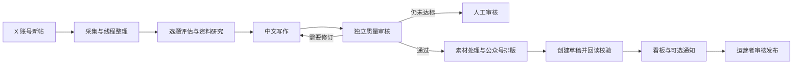

# EarlyBird

**把 X 上的 AI 行业动态，整理成可审核的中文微信公众号草稿。**

EarlyBird 持续关注指定的 X 账号，采集新帖与线程，整理事实、补充资料、撰写中文文章，再经过独立质量审核和公众号排版，保存到微信草稿箱。运营者可以在看板中查看采集状态、文章进度和需要人工处理的任务。

本项目专注于把 X 上的 AI 行业动态整理成高质量中文微信公众号草稿。全流程由 Pi Agent 驱动（自主规划、工具调用、对抗审校），以草稿生成和校验为终点，发布由运营者在公众号后台完成。

## 功能

- **持续采集**：按来源轮询新帖，首次运行建立历史基线，避免把旧帖批量生成文章；包含请求错峰、限流等待和中断任务恢复。
- **编辑与研究**：按批次评估选题，合并相关动态，选择快讯、解读或事件报道，并通过 X 搜索和可选的 Tavily 搜索补充资料。
- **中文写作与审核**：多个编辑角色分别负责研究、写作和质量检查；审核不通过时修订，仍未达标则进入人工审核。
- **素材处理**：下载原帖图片和视频，生成视频关键帧，支持语音转写、证据截图、配图来源记录，以及 900 × 383 的公众号封面。
- **公众号草稿**：生成并校验适配公众号的 HTML，上传图片和封面，创建草稿后回读验证；重新生成时记录旧草稿替换过程。
- **运行看板**：展示来源状态、任务阶段、草稿统计、采集记录和通知状态；管理 API 支持来源维护、重试和重新审核。
- **可选通知**：通过已配置的 Hermes relay 发送草稿就绪通知和每日汇总。

视频会保留为本地文件，公众号视频素材需要人工上传。通知可附带宿主机目录和文件名，方便审核后处理。

## 工作流程



默认创建 10 个来源：`openai`、`chatgpt`、`sama`、`thsottiaux`、`geminiapp`、`googledeepmind`、`claudeai`、`anthropicai`、`grok`、`xai`。来源可以通过管理 API 调整。

| 调度项 | 默认行为 |
| --- | --- |
| 来源轮询 | 每个来源约 5 分钟一次，错峰执行；限流时延后 |
| 编辑批次 | 新帖等待下一个 30 分钟批次 |
| 线程等待 | 90 秒；单次线程获取超时 60 秒 |
| 定时编辑复审 | 每天 09:00、17:00 |
| 每日汇总 | 每天 21:00 |

定时复审与汇总使用 `Asia/Shanghai` 时区。相应配置见下文。

## 快速开始：Docker Compose

准备 Docker Engine / Docker Desktop 和 Compose v2。现有镜像已包含 Node.js、Chromium、Python 3、FFmpeg 和中文字体。

还需要：有效的 X 登录 Cookie、支持图片输入和 JSON 输出的 OpenAI 兼容模型服务，以及具有素材与草稿接口权限的微信公众号凭据。Tavily、独立封面模型和通知服务可按需配置。

### 1. 获取代码

```bash
git clone https://github.com/stia-mora/Earlybird.git
cd Earlybird
```

复制 [`.env.example`](.env.example) 为 `.env`。Linux / macOS 使用 `cp .env.example .env`；Windows PowerShell 使用：

```powershell
Copy-Item .env.example .env
```

### 2. 准备本地文件

Compose 会挂载 Cookie 文件、通知令牌文件和媒体目录。即使暂时不用文件形式的 Cookie 或通知，也要先创建这两个普通文件，避免 Docker 将缺失文件创建成目录。

Linux / macOS：

```bash
mkdir -p data/earlybird/media
touch data/earlybird/x.com_cookies.txt data/earlybird/hermes-relay.token
```

Windows PowerShell：

```powershell
New-Item -ItemType Directory -Path data/earlybird/media -Force
foreach ($name in @('x.com_cookies.txt', 'hermes-relay.token')) {
    $path = Join-Path 'data/earlybird' $name
    if (!(Test-Path -LiteralPath $path)) {
        New-Item -ItemType File -Path $path
    }
}
```

Cookie 文件支持 Netscape 或 Cookie-Editor 导出格式。它包含登录凭据，应只保存在本机。

### 3. 配置 `.env`

至少填写以下项目；其中 `POSTGRES_PASSWORD` 需要自行新增。尖括号内容需要替换为自己的值。

```dotenv
POSTGRES_PASSWORD=<数据库密码，建议使用随机字母数字串>
JWT_SECRET=<独立随机密钥>
SESSION_SECRET=<另一个独立随机密钥>

EARLYBIRD_X_COOKIES_FILE=/run/secrets/earlybird-x-cookies.txt

EARLYBIRD_LLM_API_KEY=<模型服务密钥>
EARLYBIRD_LLM_BASE_URL=https://api.openai.com/v1
EARLYBIRD_LLM_MODEL=gpt-4o-mini

WECHAT_APP_ID=<公众号AppID>
WECHAT_APP_SECRET=<公众号AppSecret>
WECHAT_AUTHOR=<文章署名，可留空>
```

`EARLYBIRD_X_COOKIES_FILE` 在 Docker 中必须使用上面的**容器内路径**。也可以改为在 `.env` 中填写 `X_COOKIES="auth_token=...; ct0=..."`，并清空 `EARLYBIRD_X_COOKIES_FILE`；同时设置时，文件中的同名 Cookie 优先。

`JWT_SECRET` 必须替换 `.env.example` 中含 `change-this` 的默认值，否则生产 API 会拒绝启动。模型名称仅为配置示例，请选择服务商实际提供且支持所需输入、输出格式的模型。

Compose 会为容器设置 PostgreSQL、Redis 和媒体目录，因此容器部署不需要修改 `.env` 中用于本地开发的 `DATABASE_URL`、`REDIS_HOST` 和 `EARLYBIRD_MEDIA_DIR`。

### 4. 启动服务

```bash
docker compose up -d --build postgres redis api earlybird-worker
docker compose ps
docker compose logs -f api earlybird-worker
```

API 启动时会执行数据库迁移；EarlyBird worker 随后创建默认来源并开始采集。首次采集建立基线，后续新帖才进入文章流程。

默认地址：

| 地址 | 用途 |
| --- | --- |
| `http://localhost:3001/earlybird` | EarlyBird 运行看板 |
| `http://localhost:3001/api/health` | API 健康检查 |
| `http://localhost:3001/login` | 创建本地账号、登录 |
| `http://localhost:3001/api/earlybird/overview` | 只读运行概览 |

看板和概览接口无需登录；来源管理、任务详情、重试和审核接口需要 JWT。生产环境应根据运营范围限制看板访问。

如需同时运行上游通用任务 worker，使用 `docker compose up -d --build`。停止服务使用 `docker compose down`；数据库和 Redis 数据保存在 Compose 命名卷中。

## 本地开发

建议使用 Node.js 22 或更新版本，并准备 PostgreSQL 16、Redis 7、Python 3、FFmpeg 和可供 Puppeteer 使用的 Chromium。Python 和 FFmpeg 需要在 `PATH` 中，也可通过 `PYTHON_BIN`、`FFMPEG_PATH` 指定可执行文件。

完成上面的环境文件准备后，把 `.env` 改为本机连接信息：

```dotenv
NODE_ENV=development
DATABASE_URL="postgresql://xactions:<数据库密码>@localhost:5432/xactions?schema=public"
REDIS_HOST=localhost
REDIS_PORT=6379
EARLYBIRD_X_COOKIES_FILE=./data/earlybird/x.com_cookies.txt
EARLYBIRD_MEDIA_DIR=./data/earlybird/media
EARLYBIRD_HERMES_RELAY_URL=
```

本地暂不启用通知时，将 `EARLYBIRD_HERMES_RELAY_URL` 留空。也可只启动 Compose 中的 PostgreSQL 和 Redis：

```bash
docker compose up -d postgres redis
npm ci
npx prisma generate
npx prisma migrate deploy
```

随后在两个终端分别启动 API 和采集 worker。以下命令适用于 Windows、Linux 和 macOS：

```bash
# 终端一
node --env-file=.env api/server.js
```

```bash
# 终端二
node --env-file=.env src/earlybird/worker.js
```

需要指定本机浏览器时，在 `.env` 设置 `PUPPETEER_EXECUTABLE_PATH`。Prisma CLI 自动读取 `.env`；API 和 worker 使用上述 `--env-file` 加载配置。

## 可选配置

全部配置项可从 [`.env.example`](.env.example) 和 [Compose 配置](docker-compose.yml) 查阅。以下配置适用于文章流程：

| 配置 | 用途 |
| --- | --- |
| `EARLYBIRD_X_PROXY` | X 采集使用的 HTTP / SOCKS 代理 |
| `EARLYBIRD_LLM_FALLBACK_API_KEY` / `BASE_URL` / `MODEL` | 主模型失败后使用的备用模型，对应变量均以 `EARLYBIRD_LLM_FALLBACK_` 开头 |
| `EARLYBIRD_TAVILY_API_KEY` | 全网资料搜索与配图搜索 |
| `EARLYBIRD_COVER_IMAGE_API_KEY` / `BASE_URL` / `MODEL` | 独立封面生成服务，对应变量均以 `EARLYBIRD_COVER_IMAGE_` 开头 |
| `EARLYBIRD_COVER_IMAGE_FALLBACK_API_KEY` / `BASE_URL` / `MODEL` | 备用封面服务，对应变量均以 `EARLYBIRD_COVER_IMAGE_FALLBACK_` 开头 |
| `EARLYBIRD_STT_API_KEY` / `EARLYBIRD_STT_MODEL` | 视频音频转写 |
| `EARLYBIRD_PUBLIC_MEDIA_URL` | 可公开访问的媒体基础 URL |
| `EARLYBIRD_HOST_MEDIA_DIR` | 通知中展示的宿主机媒体绝对路径，需要改为实际目录 |
| `EARLYBIRD_EDITORIAL_BATCH_MINUTES` | 编辑批次间隔，默认 `30` |
| `EARLYBIRD_CONCURRENCY` | 文章处理并发数，默认 `1` |
| `EARLYBIRD_DAILY_EDITORIAL_REVIEW_CRON` | 定时复审，默认 `0 9,17 * * *` |
| `EARLYBIRD_DAILY_SUMMARY_CRON` | 每日汇总，默认 `0 21 * * *` |

封面生成依次尝试主服务、备用服务和原帖素材。缺少可用素材或文章质量未达标时，任务可能进入人工审核；可在任务详情中查看原因。配图来源会被记录，发布前仍需审核素材使用权限。

如需固定文末图片，将图片放在 `data/earlybird/media/fixed-end/earlybird-endcard.png`。

通知依赖一个可用的 Hermes relay，以及已配置的 Hermes 投递目标。Docker 默认请求宿主机的 `http://host.docker.internal:8767/notify`，令牌从 `data/earlybird/hermes-relay.token` 挂载读取；本地进程需自行设置 `EARLYBIRD_HERMES_RELAY_TOKEN_FILE`。未配置可用 relay 时，Docker 中的通知会记录失败，但不会撤销已生成的草稿。

## 管理 API

先通过 `/api/auth/register` 创建账号，再通过 `/api/auth/login` 获取 JWT；管理请求使用 `Authorization: Bearer <token>`。看板主要用于查看运行情况，来源维护和任务操作通过以下接口完成。

| 方法与路径 | 用途 |
| --- | --- |
| `GET /api/earlybird/overview` | 只读概览，无需 JWT |
| `GET /api/earlybird/sources` | 来源列表 |
| `POST /api/earlybird/sources` | 新增来源：`handle`、可选 `displayName` / `website` / `enabled` / `pollIntervalSeconds` |
| `PATCH /api/earlybird/sources/:id` | 修改来源与轮询间隔 |
| `DELETE /api/earlybird/sources/:id` | 删除来源；默认来源在 worker 下次启动时会补建，长期停用请设 `enabled: false` |
| `GET /api/earlybird/jobs` | 任务列表，可用 `status` 筛选 |
| `GET /api/earlybird/jobs/:id` | 任务详情、素材、审核与草稿记录 |
| `GET /api/earlybird/jobs/:id/preview` | 文章预览 |
| `POST /api/earlybird/jobs/:id/retry` | 重新入队 |
| `POST /api/earlybird/jobs/:id/review` | 强制编辑复审 |
| `POST /api/earlybird/jobs/:id/create-draft` | 强制重新处理并生成草稿，可能替换该任务管理的旧草稿 |
| `GET /api/earlybird/polls` | 采集记录 |
| `GET /api/earlybird/notifications` | 通知投递记录 |

除概览外，上述接口均需认证。新增来源后首次轮询同样建立历史基线。

## 项目结构

```text
src/earlybird/                 采集、研究、写作、审核、素材与公众号流程
api/routes/earlybird.js        EarlyBird 管理 API
dashboard/earlybird.html       运行看板页面
dashboard/js/earlybird/        看板前端模块
prisma/                       数据模型与数据库迁移
scripts/                      通知转发、验证与构建工具
docs/earlybird.md              EarlyBird 补充文档
data/earlybird/                本机凭据、媒体与运行数据（Git 忽略）
```

`.env`、运行数据、依赖目录和构建产物由 Git 忽略。媒体目录还包含待人工上传的视频；清理前请确认任务已完成并保留所需素材。Python 文档源文件位于 `python/docs/`，`python/site/` 是可重新生成的文档产物。

## 测试与文档检查

```bash
npm test
npm run lint
node scripts/audit-docs.mjs README.md
npm run ask:index:check
```

修改 README 或其他被收录的文档后，运行 `npm run ask:index` 更新问答索引，再执行索引检查。

2026-10-01 的本地完整测试结果为 **1823 项通过、0 项失败、31 项跳过**，ESLint 检查通过。测试不替代真实 X 账号、模型服务、微信接口和通知渠道的部署验证。

## 常见问题

| 现象 | 检查方向 |
| --- | --- |
| API 提示 JWT 配置错误 | 替换 `.env.example` 的默认密钥，检查 `JWT_SECRET` |
| 启动后没有生成文章 | 首次轮询仅建基线；检查是否出现新帖，并等待编辑批次 |
| 来源长期未更新 | 检查 worker、Cookie 有效性、代理和限流记录 |
| 任务进入 `manual_review` | 查看审核意见、事实依据、图片数量和渲染校验结果 |
| 微信草稿或素材接口报错 | 检查公众号凭据、接口权限和服务器出口 IP 白名单 |
| 草稿正常但通知失败 | 检查 relay 是否可达、令牌是否一致以及 Hermes 投递目标 |
| Docker 提示挂载文件类型错误 | 确认两个凭据路径是普通文件，而不是目录 |

## XActions 工具集与文档

原有 Node.js 库、`xactions` CLI、MCP server、浏览器脚本、工作流及集成功能仍在仓库中，包名和原有命令保持 `xactions`。

- [XActions 入门](docs/getting-started.md)
- [MCP 配置](docs/mcp-setup.md)
- [API 参考](docs/api-reference.md)
- [浏览器脚本目录](docs/browser-scripts.md)
- [Agent Skills](docs/skills.md)
- [EarlyBird 补充文档](docs/earlybird.md)

## 许可证与来源

项目遵循 [Apache License 2.0](LICENSE)。XActions 原项目由 [nich / @nichxbt](https://github.com/nirholas) 创建；本仓库在其基础上添加和维护 EarlyBird 工作流。第三方代码及许可证说明见 [THIRD-PARTY-NOTICES.md](THIRD-PARTY-NOTICES.md)。
